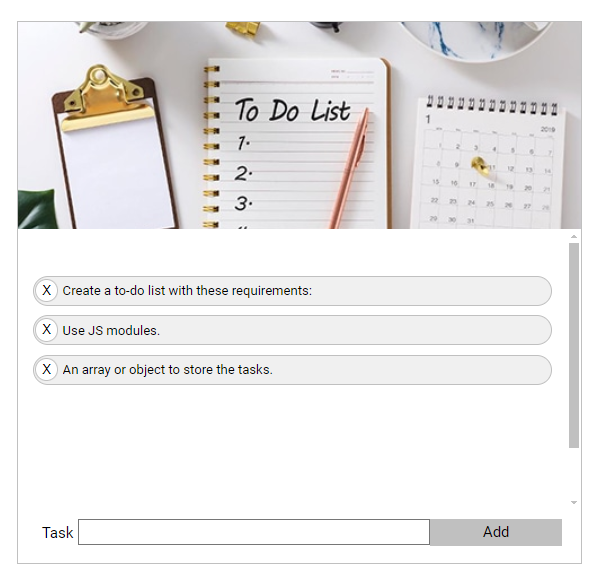

# To Do List

## Purpose

The purpose of this project exercise is to work on the local storage, DOM manipulation with JavaScript, and implementing a free drag-and-drop interaction.

## Instructions

The link to the instructions is available [here](https://github.com/becodeorg/CRL-KELLER-7/tree/main/2.PROJECTS/4.To-do-list).

## Languages Used

- Semantic HTML, SCSS
- Usage of BEM Methodology
- Responsive design
- JavaScript
- The DOM
- Event listeners

## GitHub Page 

You can access the project on GitHub Pages [here](https://ludoviclacroix82.github.io/To-do-list/).

